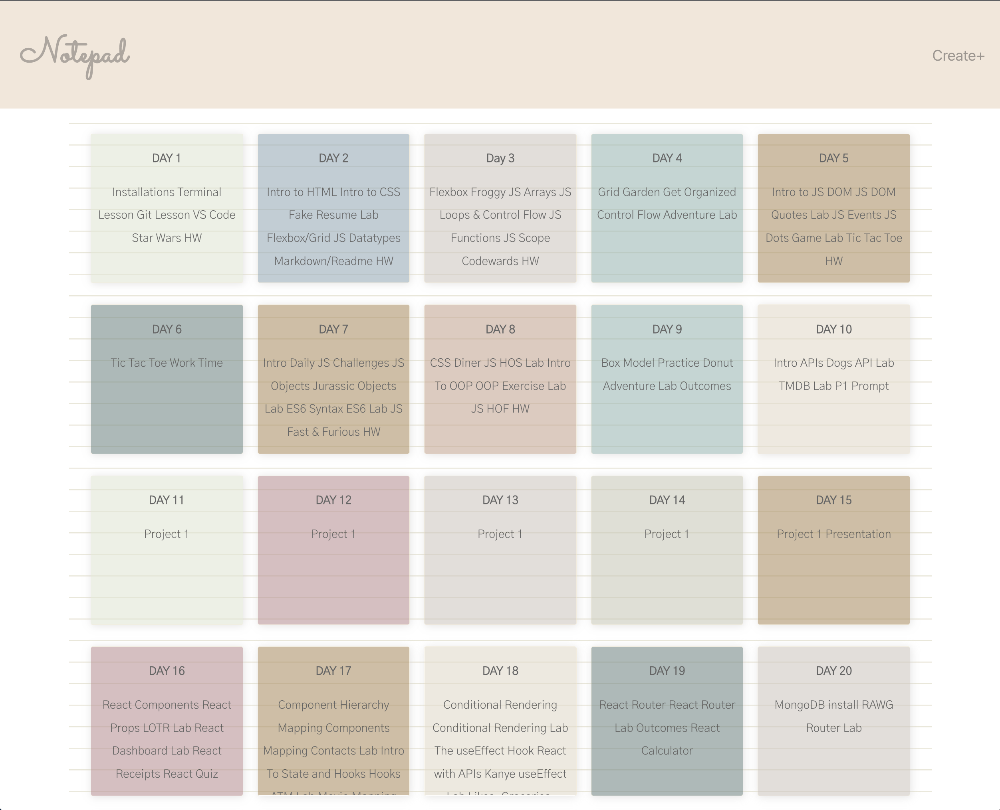

# Notepad MERN Project

#### Date Started: October 20, 2022

#### By: Marissa Dilig

## [My Github](https://github.com/maripd) | [My Linkedin](https://www.linkedin.com/in/marissa-dilig-6ba71923a/) | [Trello](https://trello.com/b/78Bt7G4o/wordzzled) | 

 | [Hierarchy Component Diagram](client/src/hierarchy-component.png) | [ERD](client/src/ERD.png)

##### **Description**

##### This is a Notepad app where you can store your notes. When you create and save new notes, it will be displayed on the main page. To edit a note, you can click the note card and it will bring you to the page editor. Aside from editing, you can also delete your note, add emoji stickers to indicate how you are feeling at that moment. Each time you create and save a new note, a random background color is generated to style your note card. 

#### Things I plan to improve: 
#### 1. Replace pumpkin stickers with journaling or organizer stickers.
#### 2. Add a drag and drop feature for the stickers.
#### 3. Add delete function for the stickers.
#### 4. Add conditional statement regarding the event handler for clicking stickers. Stickers should not be more than 10.
#### 5. Improve responsive design and/or overall design.

### Credit:

##### Markdown Cheatsheet: [Github](github.com)
